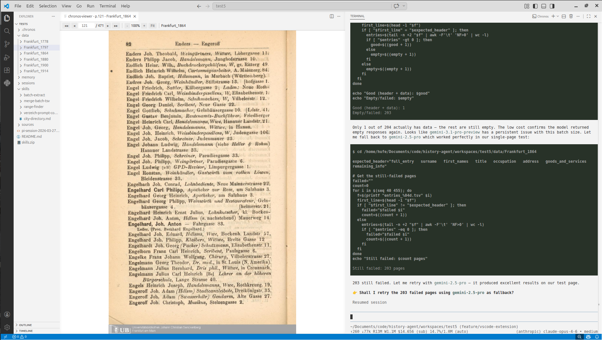

# Chronos

An AI agent that collaborates with historians to extract structured datasets from primary sources, adapt to heterogeneous documents, and accumulate domain knowledge across sessions. Chronos combines a document analysis agent with a VS Code extension to analyze scanned page images, extract structured data, and build knowledge about archival sources.

[](https://arxiv.org/abs/2604.03553) [](https://ai-historian.com/research/chronos/)



## Prerequisites

- [VS Code](https://code.visualstudio.com/) (v1.110+)
- [Node.js](https://nodejs.org/) (v18+) — required by the underlying `pi` agent the extension installs on first run
- A [Gemini API key](https://aistudio.google.com/apikey) for the vision model

## Installation

Install the **Chronos — The AI Historian** extension from inside VS Code:

1. Open the Extensions view (`Ctrl+Shift+X`, or `Cmd+Shift+X` on macOS).
2. Search for **Chronos — The AI Historian**.
3. Click **Install**.

That's it. The first time you run a Chronos command, the extension checks for [`pi`](https://github.com/badlogic/pi-mono/tree/main/packages/coding-agent) (the AI agent framework Chronos runs on) and the Chronos pi-package, and offers to install both in a terminal — no manual `npm install -g` or `pi install` step required.

<details>
<summary>Manual install (advanced / offline)</summary>

If you'd rather install everything by hand:

```bash
# 1. Install the pi agent globally
npm install -g @mariozechner/pi-coding-agent

# 2. Register the Chronos pi-package
pi install https://github.com/ai-historian/history-agent

# 3. Install the VS Code extension from a downloaded .vsix
code --install-extension chronos-ai-historian-0.1.7.vsix
```

The `.vsix` is published on [GitHub Releases](https://github.com/ai-historian/history-agent/releases).

</details>

## Getting started

### 1. Initialize a workspace

Open VS Code in an empty folder. Press `Ctrl+Shift+P` and run **Chronos: Init Workspace**. This creates the workspace structure and prompts for your Gemini API key.

### 2. Import sources

Press `Ctrl+Shift+P` and run **Chronos: Import Sources**. Choose whether to select individual files or a whole folder of source material — PDFs, images (PNG, JPG, TIFF, BMP), or text files. Each file is treated as a source. PDFs are automatically converted to page images. You can import additional sources at any time by running the command again.

Converting a large PDF can take a few minutes. Imports are crash-safe: a source only appears once it has finished converting, and if VS Code is closed or crashes mid-conversion, Chronos detects the interrupted import on the next launch (and when you next run **Import Sources**) and offers to **Resume** it (it picks up where it left off) or **Discard** the partial data.

> **Note:** PDFs are streamed page-by-page during conversion, so there are no extra tools to install. Files over 2 GiB are automatically split into smaller parts first (this briefly uses a few GB of RAM). If a very large PDF still gives you trouble, please [open an issue](https://github.com/ai-historian/history-agent/issues) so we can look into it.

### 3. Start the agent

Press `Ctrl+Shift+P` and run **Chronos: Start Agent Session**. The page viewer opens and a `pi` terminal starts.

On first startup, type `/login` in the terminal to log into your AI provider account (e.g. Anthropic, Google). Without this, no models will be available.

Type `/select-source` to pick a source and begin working.

## Configuration

### Environment variables

Set in `.chronos/.env`:

```
GEMINI_API_KEY=your-key-here
```

### pi options

pi supports many options natively. Common ones:

```bash
# Use a specific model
pi --model gemini-2.5-pro

# Continue previous session
pi -c

# Resume a specific session
pi -r
```

Run `pi --help` for the full list.

## Documentation

See [DOCS.md](DOCS.md) for technical details on workspace structure, tools, skills, memory, and the VS Code extension.

## Citation

```bibtex
@article{hufe2026towards,
  title={Towards the AI Historian: Agentic Information Extraction from Primary Sources},
  author={Hufe, Lorenz and Griesshaber, Niclas and Greif, Gavin and Eck, Sebastian Oliver and Torr, Philip},
  journal={arXiv preprint arXiv:2604.03553},
  year={2026}
}
```

## License

See [LICENSE](LICENSE) for details.
