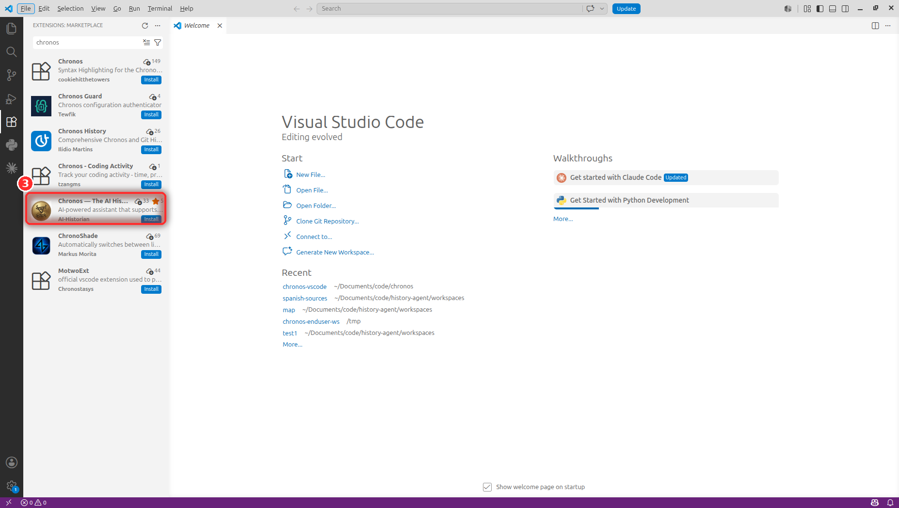
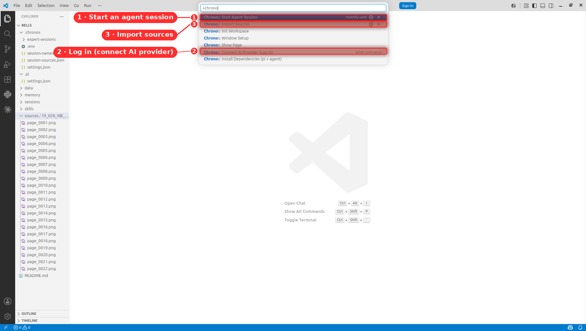
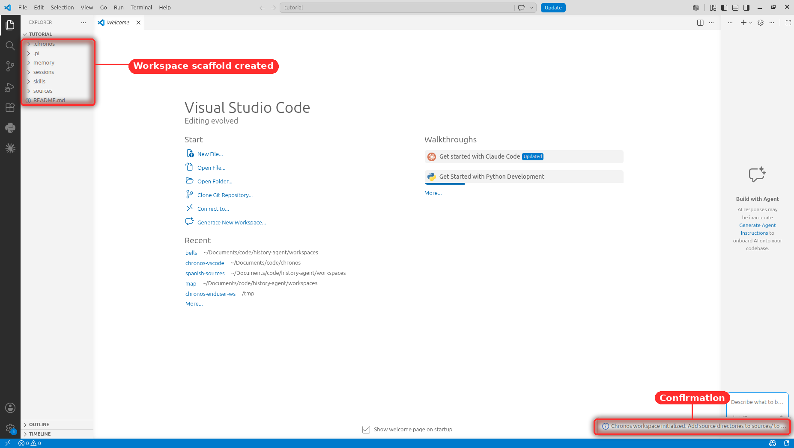
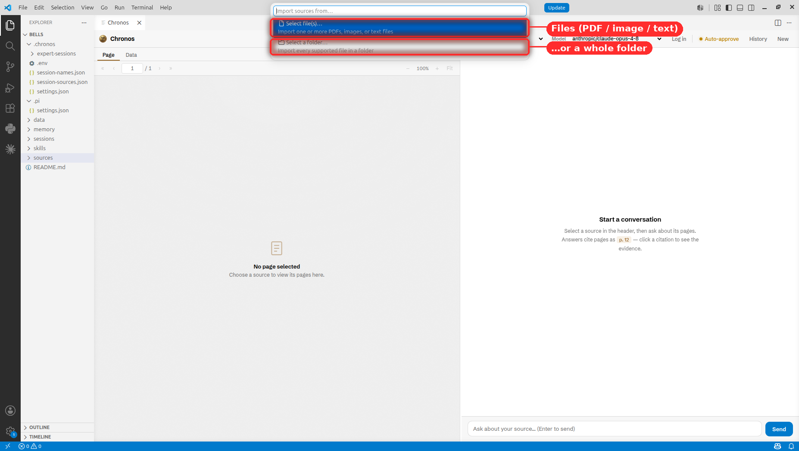
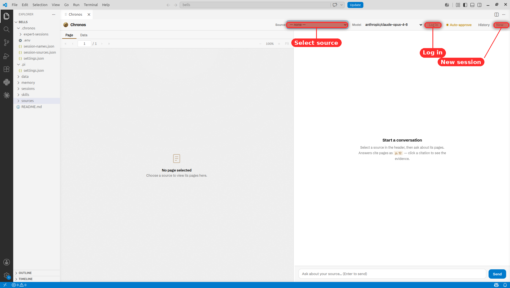
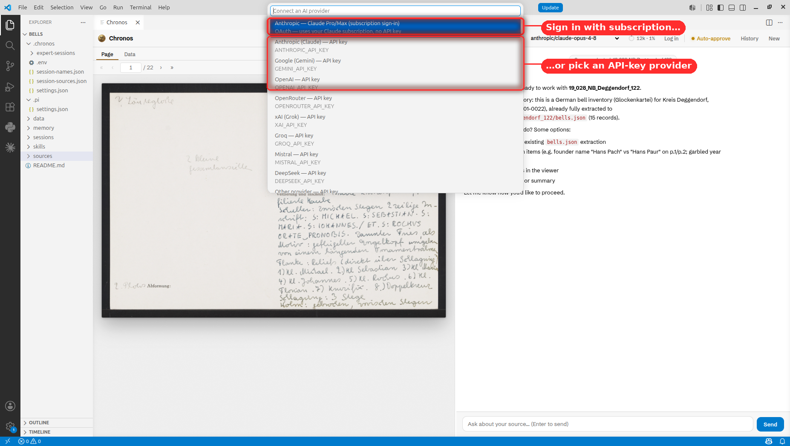
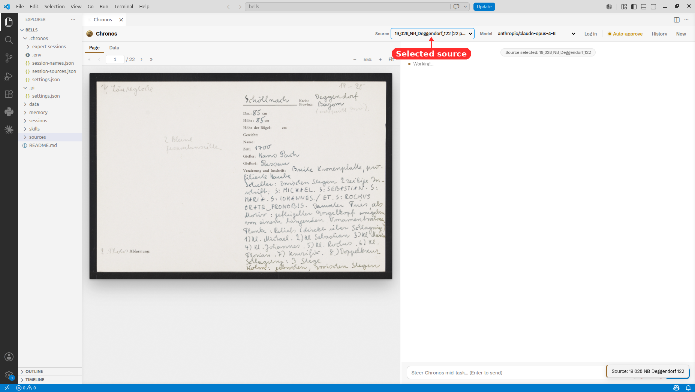

# Chronos

An AI agent that collaborates with historians to extract structured datasets from primary sources, adapt to heterogeneous documents, and accumulate domain knowledge across sessions. Chronos combines a document analysis agent with a VS Code extension to analyze scanned page images, extract structured data, and build knowledge about archival sources.

[](https://arxiv.org/abs/2604.03553) [](https://ai-historian.com/research/chronos/)


## Prerequisites

- [VS Code](https://code.visualstudio.com/) (v1.110+)
- [Node.js](https://nodejs.org/) (v18+) — required by the underlying `pi` agent the extension installs on first run
- An API key for an AI provider with a vision-capable model (Anthropic, Google, OpenAI, …). You connect it from inside the panel — see [Start the agent](#3-start-the-agent).

## Installation

Install the **Chronos — The AI Historian** extension from inside VS Code:

1. Open the Extensions view (`Ctrl+Shift+X`, or `Cmd+Shift+X` on macOS).
2. Search for **Chronos — The AI Historian**.
3. Click **Install**.


*Several extensions match "Chronos" — pick **Chronos — The AI Historian** (by AI-Historian), then click **Install**.*

That's it. The first time you run a Chronos command, the extension checks for [`pi`](https://github.com/badlogic/pi-mono/tree/main/packages/coding-agent) (the AI agent framework Chronos runs on) and the Chronos pi-package, and offers to install both in a terminal — no manual `npm install -g` or `pi install` step required.

<details>
<summary>Manual install (advanced / offline)</summary>

If you'd rather install everything by hand:

```bash
# 1. Install the pi agent globally
npm install -g @earendil-works/pi-coding-agent

# 2. Register the Chronos pi-package
pi install https://github.com/ai-historian/chronos

# 3. Install the VS Code extension from a downloaded .vsix
code --install-extension chronos-ai-historian-0.2.0.vsix
```

The `.vsix` is published on [GitHub Releases](https://github.com/ai-historian/chronos/releases).

</details>

## Getting started

Every Chronos action lives in the Command Palette — press `Ctrl+Shift+P` and type *chronos*.


*The three steps below all start here: **Start Agent Session**, **Connect AI Provider**, and **Import Sources**.*

### 1. Initialize a workspace

Open VS Code in an empty folder. Press `Ctrl+Shift+P` and run **Chronos: Init Workspace**. This creates the workspace structure. (You connect an AI provider in step 3 — no key is needed yet.)


*Init Workspace scaffolds `sources/`, `data/`, `memory/`, `skills/`, and `sessions/` into the folder.*

### 2. Import sources

Press `Ctrl+Shift+P` and run **Chronos: Import Sources**. Choose whether to select individual files or a whole folder of source material — PDFs, images (PNG, JPG, TIFF, BMP), or text files. Each file is treated as a source. PDFs are automatically converted to page images. You can import additional sources at any time by running the command again.


*Pick individual files (PDF / image / text) or a whole folder.*

Converting a large PDF can take a few minutes. Imports are crash-safe: a source only appears once it has finished converting, and if VS Code is closed or crashes mid-conversion, Chronos detects the interrupted import on the next launch (and when you next run **Import Sources**) and offers to **Resume** it (it picks up where it left off) or **Discard** the partial data.

> **Note:** PDFs are streamed page-by-page during conversion, so there are no extra tools to install. Files over 2 GiB are automatically split into smaller parts first (this briefly uses a few GB of RAM). If a very large PDF still gives you trouble, please [open an issue](https://github.com/ai-historian/chronos/issues) so we can look into it.

### 3. Start the agent

Press `Ctrl+Shift+P` and run **Chronos: Start Agent Session**. The Chronos panel opens — a page viewer on the left and a chat on the right.


*From the panel header you select a **Source**, **Log in**, or start a **New** session.*

On first startup no AI models are available until you connect a provider. Click **Log in** in the panel header (or run **Chronos: Connect AI Provider**) and choose how to sign in:

- **Anthropic — Claude Pro/Max (subscription):** signs in with your Claude subscription via OAuth in the browser — no API key needed. The credential is stored in pi's `~/.pi/agent/auth.json`.
- **API key (any provider):** paste a key; Chronos saves it to the workspace `.chronos/.env`.


*Sign in with a Claude subscription, or paste an API key for any supported provider.*

Either way Chronos reconnects automatically. You can switch or add providers the same way at any time.

Pick a source from the header dropdown (or type `/select-source`) and begin working.


*Once a source is selected, its pages render in the viewer and the agent is ready.*

## Configuration

### AI provider & models

Connect a provider with the **Log in** button (above); it stores the key in `.chronos/.env`. You can also edit that file directly — pi reads the standard per-provider variables:

```
ANTHROPIC_API_KEY=...      # Claude
GEMINI_API_KEY=...         # Google Gemini
OPENAI_API_KEY=...         # OpenAI
# OPENROUTER_API_KEY, XAI_API_KEY, MISTRAL_API_KEY, GROQ_API_KEY, DEEPSEEK_API_KEY, …
```

The page-analysis tools (`task` / `task_batch`) default to the model selected in the header, but accept any vision-capable model pi has auth for via a `model: "provider/model-id"` argument. Chronos is provider-agnostic — choose what fits your budget and accuracy needs. As a starting point, a fast/cheap vision model (e.g. `google/gemini-3-flash-preview`) works well for routine pages, and a stronger model (e.g. `google/gemini-3.1-pro-preview` or `anthropic/claude-opus-4-8`) helps on dense or damaged pages.

### pi options

pi supports many options natively. Common ones:

```bash
# Use a specific model
pi --model anthropic/claude-opus-4-8

# Continue previous session
pi -c

# Resume a specific session
pi -r
```

Run `pi --help` for the full list.

## Documentation

See [DOCS.md](DOCS.md) for technical details on workspace structure, tools, skills, memory, and the VS Code extension.

## Citation

```bibtex
@article{hufe2026towards,
  title={Towards the AI Historian: Agentic Information Extraction from Primary Sources},
  author={Hufe, Lorenz and Griesshaber, Niclas and Greif, Gavin and Eck, Sebastian Oliver and Torr, Philip},
  journal={arXiv preprint arXiv:2604.03553},
  year={2026}
}
```

## License

See [LICENSE](LICENSE) for details.
