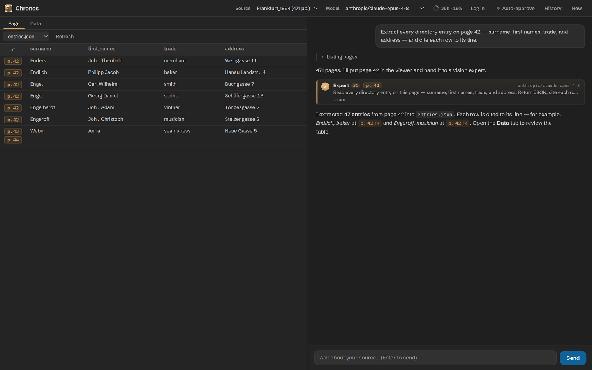
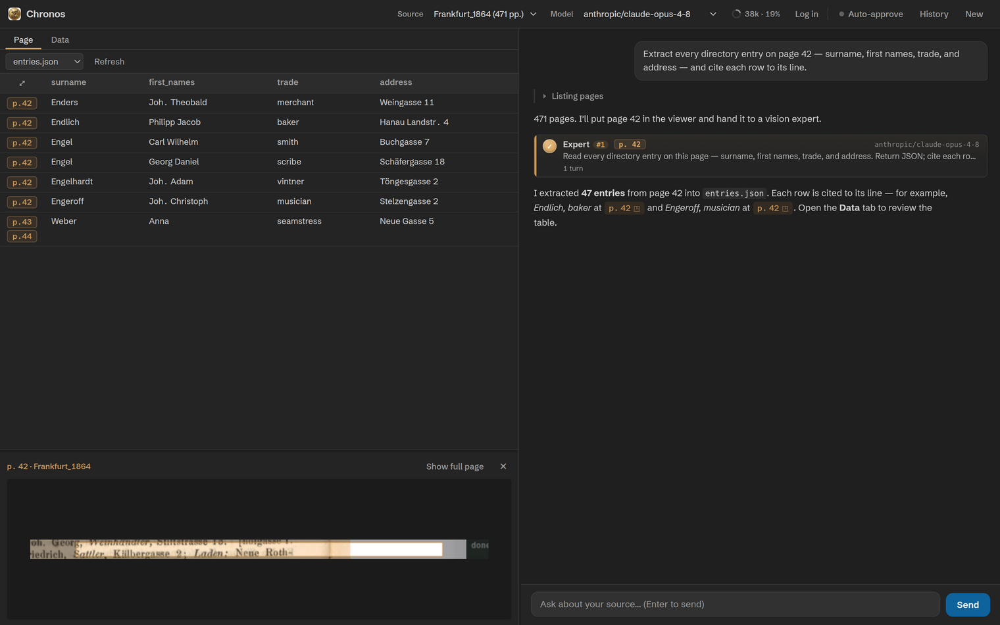

# The Data tab

The Data tab turns the JSON the agent writes into a sortable, source-linked
table — the working surface where you check an extraction against the scans.

## Where outputs come from

Chronos writes extraction results to `data/<source-name>/`, one file per output. The Data tab lists every
file there for the current source (basenames, alphabetically; dotfiles hidden) in a dropdown, with a
**Refresh** button beside it. The list updates automatically:

- at the **end of every agent turn** (a turn may have written new files);
- when you **switch source**;
- when you click **Refresh** (which also reloads the open file);
- when you switch to the Data tab.

It clears when you start a new session.

## Three ways it renders a file

| The file is… | Rendered as |
|---|---|
| a JSON **array of objects** | a sortable table — one row per object, columns from the union of keys (first-seen order), sticky header |
| a single JSON **object** | a one-row table |
| anything else — free text, CSV, an array of primitives, partial JSON | shown as text (pretty-printed if it parsed as JSON, otherwise raw) |

<figure markdown="span">
  
  <figcaption>A JSON array of objects becomes a sortable table; the reserved provenance keys become bronze p.N chips in the leading column. <b>Chronos UI rendered with sample data.</b></figcaption>
</figure>

Click a column header to sort; numbers compare numerically, everything else alphabetically; click again to
reverse. Sorting keeps each row's citations attached.

## The provenance column

If any row carries a resolvable citation, a leading column appears (its header is a small ⤢ glyph). The
three reserved keys — `chronos_page`, `chronos_bbox`, `chronos_source` — are **never shown as data
columns**; instead each reference becomes a bronze p.&nbsp;N chip. A row can show
several chips when it cites multiple locations. The data model behind these keys is the subject of
[Provenance &amp; bounding boxes](provenance.md).

## Click-to-source: the region preview

Clicking a chip opens an inline preview **docked at the bottom of the Data tab** — it does *not* switch to
the Page tab. The cited region is cropped from the page — the box enlarged by about 40% (roughly a 20%
margin on each side) — outlined in bronze, with the surrounding margin dimmed. The dock starts at ~30% of
the height and is resizable by dragging the divider (15–70%).

<figure markdown="span">
  
  <figcaption>Clicking a chip docks a region preview at the bottom — bronze outline, dimmed margin — without leaving the Data tab. <b>Chronos UI rendered with sample data.</b></figcaption>
</figure>

The preview is independent of the Page viewer, so you can keep your place there. The one handoff is
**Show full page**, which opens the *whole* page (not the crop) in the Page tab. If a citation has a page
but no box, the preview just shows that full page.

## Empty states

With no source selected the tab reads *"No source selected."* With a source but no outputs yet, *"No data
yet — extraction outputs will appear here."* Both resolve the moment the agent writes its first file.
