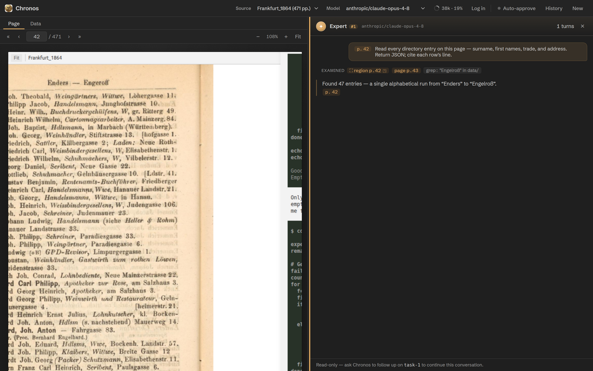
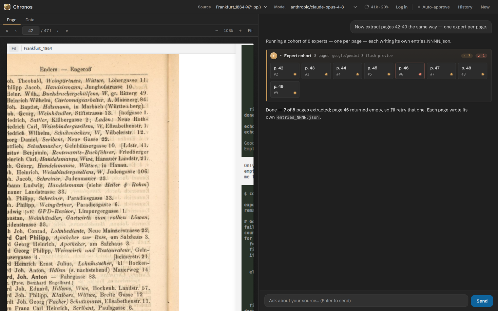

# Experts & analysis tools

Chronos doesn't read pages in the main conversation. It dispatches dedicated
vision <em>experts</em> — one per page — that can zoom in on their own, keep their own context, and (only
when you allow it) act on the workspace. This is the engine room.

## Orchestrator and experts

The model you pick in the header is the **orchestrator**: it plans, samples, and writes output. To actually
read a page it calls the `task` tool, which spawns a persistent **expert** conversation around that page's
image. Keeping vision work in a sub-agent keeps the orchestrator's context clean and lets each page get
focused attention.

## task — a single expert

`task` spawns an expert and returns a `task_id`. Attach a page with `page_id` (optionally pre-cropped with a
`bbox`), and pick a model per call if you want. Pass the `task_id` back on a later `task` call to ask
**follow-up** questions in the same conversation — the page image isn't re-sent, so follow-ups are cheap.

<figure markdown="span">
  
  <figcaption>An expert's read-only transcript: the page it read, the steps it examined (region/page/grep, elevated actions flagged), and its reply. <b>Chronos UI rendered with sample data.</b></figcaption>
</figure>

Expert conversations are persisted per session, so `task_id` follow-ups keep working after the agent
restarts or a session is resumed. Page images aren't duplicated in storage — they're re-cropped from disk
on restore.

## Experts steer themselves

An expert isn't limited to the single image it's handed. It runs a bounded agentic loop (up to **8 tool
calls per turn**) and is **read-only by default**, with these tools:

| Tool | What it does |
|---|---|
| `view_region(bbox, [page_id])` | Crop a region at full resolution — a dense table, a marginal note, faint ink. Omit `page_id` to zoom into the page in view. |
| `view_page(page_id)` | Load another full page from the same source. |
| `read_file` · `list_dir` · `grep` | Read and search the workspace — schemas, memory, prior outputs. Scoped to the workspace root. |

So you don't have to predict the right crop up front: hand the expert the page and let it zoom and
cross-reference where it needs to.

## Granting capabilities (off by default)

Experts **cannot run commands or change files** unless the orchestrator passes `grant` on the call:

| Grant | Unlocks |
|---|---|
| `grant: ["bash"]` | `bash(command)` — runs in the workspace |
| `grant: ["write"]` | `write_file(path, content)` |
| `grant: ["edit"]` | `edit_file(path, old_text, new_text)` |

!!! danger "Human-gated by design"
    Requesting any grant triggers a **confirmation before any expert runs** — once per `task` call, or once
    for a whole `task_batch` cohort. Denying it aborts the call. Granted **file** operations (write/edit) are
    confined to the workspace; granted **bash** runs with its working directory set to the workspace. The
    runtime re-checks the grant before each elevated call. Leave `grant` off unless a task genuinely needs
    the expert to act on its own.

## Everything is auditable

Whatever an expert does is surfaced in its card and transcript drawer: every region viewed, page loaded,
file read or searched, and command run shows as an *examined* step. Region and page steps are clickable
viewer links; elevated actions (bash / write / edit) are visually flagged. The drawer is read-only — to
continue a conversation, ask Chronos to follow up on its `task_id`.

## task_batch — one expert per page

To cover a range, `task_batch` spawns a cohort of experts — one per page in `page_ids` — running
concurrently (default 4 at a time, up to 20). The same prompt and optional `bbox` apply to every page, and
an `output_file` template with a `{page_id}` placeholder writes one file per page. Because a batch spends
real budget across many pages, Chronos is instructed to lay out the plan first — pages, prompt, model, and
output file — and get your go-ahead before running it. Each expert in the cohort is still follow-up-able by
its own `task_id`.

<figure markdown="span">
  
  <figcaption>A task_batch cohort — one expert per page, summarised with a per-page grid and pass/fail counts. <b>Chronos UI rendered with sample data.</b></figcaption>
</figure>

## Choosing a model

Experts default to the orchestrator's model, but accept any `provider/model-id` your key covers — no
provider is hard-coded. The model must be vision-capable when a page image is attached; an unknown name
errors with the list of available models. As a guide:

- a fast, cheap vision model (e.g. `google/gemini-3-flash-preview`) handles routine pages well;
- reach for a stronger one (e.g. `google/gemini-3.1-pro-preview` or `anthropic/claude-opus-4-8`) on dense tables, marginalia, or faint/damaged ink.

Often, letting an expert *zoom in* matters more than raw model size.

## Limits

| Bound | Value |
|---|---|
| Tool calls per expert turn | 8 |
| Batch concurrency | 4 default (1–20) |
| `read_file` cap | 100,000 characters |
| `grep` caps | 100 matches, 3,000 files |
| `bash` (when granted) | 30-second timeout, 1&nbsp;MiB output |
