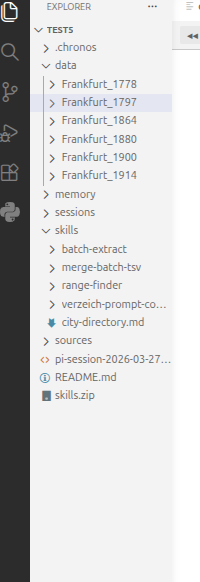

# Your first extraction

<p class="lead" markdown="span">From an empty folder to a cited dataset in a few minutes. This walks through
the whole loop: initialise, import, ask, and review.</p>

## Initialise a workspace

Open VS&nbsp;Code on an empty folder, press <kbd>Ctrl</kbd>+<kbd>Shift</kbd>+<kbd>P</kbd>, and run
**Chronos: Init Workspace**. It scaffolds the structure below. (No API key is needed yet — you connect a
provider when you start a session.)

```text title="a fresh Chronos workspace"
<workspace>/
├── sources/                 # imported scans, one folder per source
│   └── Frankfurt_1864/
│       └── png/
│           ├── page_0001.png
│           └── …
├── data/                    # extraction outputs (created when the agent writes)
│   └── Frankfurt_1864/
│       └── entries.json
├── memory/                  # persistent knowledge
│   ├── MEMORY.MD            # cross-source insights
│   └── Frankfurt_1864.md    # per-source findings
├── skills/                  # your reusable task definitions
│   └── extract-entries/SKILL.md
├── sessions/                # conversation history
├── .pi/settings.json        # bridges skills/ into pi
└── .chronos/                # .env (keys), settings.json, session sidecars
```

<figure markdown="span">
  { width="240" }
  <figcaption>The same folders in the Explorer. <b>Real screenshot.</b></figcaption>
</figure>

!!! note
    Init creates `sources/`, `memory/` (with an empty `MEMORY.MD`), `skills/`, `sessions/`, `.pi/`, and
    `.chronos/`. The `data/` folder appears the first time the agent writes an extraction — you don't
    create it yourself.

## Import sources

Run **Chronos: Import Sources** and pick individual files or a whole folder. Each file becomes a source.
Supported inputs:

- **PDF** — converted page-by-page to `page_NNNN.png` at 200&nbsp;DPI.
- **Images** — PNG and JPEG are used directly as pages. (TIFF and BMP can also be imported, but PNG and JPEG are the formats the viewer and tools work with.)
- **Text** — `.txt` files are copied in as-is.

Converting a large PDF can take a few minutes. Imports are **crash-safe**: a source only appears once it
has finished converting, and conversion happens in a hidden `.png.partial/` staging folder that is renamed
into place atomically when complete. If VS&nbsp;Code closes mid-conversion, Chronos detects the interrupted
import on the next launch and offers to **Resume** (it picks up where it left off, skipping pages already
rendered) or **Discard** the partial data.

!!! note "Very large PDFs"
    PDFs are streamed page-by-page, so there are no extra tools to install. Files over 2&nbsp;GiB are
    automatically split into ~1&nbsp;GiB parts first (this briefly uses a few GB of RAM), each rendered and
    then deleted.

## Start a session and pick a source

Run **Chronos: Start Agent Session**. The panel opens with a page viewer on the left and a chat on the
right. Connect a provider with **Log in** if you haven't ([how](installation.md#connect-an-ai-provider)),
then choose a source from the **Source** dropdown in the header — or type `/select-source` in the chat.

## Ask for an extraction

Describe what you want in plain language. A good first move is to let Chronos learn the document before
extracting at scale:

```text title="chat"
List the pages, then look at page 42 and extract every directory entry —
surname, first names, trade, and address — as JSON. Cite each row to its line on the page.
```

Chronos will typically call `list_pages` to learn the extent, `show_page` to put the page in the viewer,
and then dispatch a vision **expert** (the `task` tool) to read it. The expert can zoom into the page
itself to resolve dense rows or faint ink. Watch its work in the chat: an *Expert* card appears, and
clicking it opens a transcript drawer showing exactly what it examined. See
[Experts &amp; analysis tools](experts.md).

## Review the cited output

When the agent writes results to `data/<source>/`, the **Data** tab (next to **Page**) refreshes
automatically and renders the JSON as a sortable table. Reserved provenance keys become a bronze
<span class="chip">p.&nbsp;42</span> chip in a leading column. Click a chip and the cited region is cropped
and outlined right there — no tab switch — with a **Show full page** button to open the whole scan in the
viewer.

Read more in [The Data tab](data-viewer.md) and [Provenance &amp; bounding boxes](provenance.md).

## Scale up and let it remember

Once a single page looks right, ask Chronos to run across a range — it can fan out one expert per page
with `task_batch`. Two habits make repeat work fast:

- **Write a skill** for the task so you can re-run it with `/skill:<name>` on the next volume.
- **Let memory accrue** — Chronos records page ranges, abbreviations, and layout quirks per source, and reloads them next session.

Both are covered in [Skills &amp; memory](skills-memory.md).
