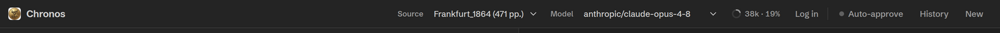
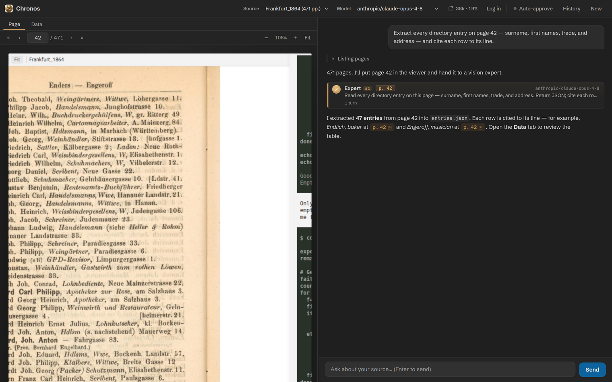

# The Chronos panel

Everything happens in one combined panel: a page viewer on the left, a chat on
the right, a draggable splitter between them. Here's every part of it.

<figure markdown="span">
  
  <figcaption>The panel header: brand, Source and Model pickers, the context-window ring, Log in, Auto-approve, History, and New. <b>Chronos UI rendered with sample data.</b></figcaption>
</figure>

## The header

Left to right, the header holds:

- **Source** — the active source. Switching it re-points every tool and shows page&nbsp;1.
- **Model** — the orchestrator model (`provider/model-id`); experts default to this unless told otherwise.
- **Context ring** — how full the model's context window is. pi compacts automatically as it fills.
- **Log in** — connect or switch an AI provider.
- **Auto-approve** — the *yolo* toggle. When on, bash commands run without a per-command prompt. Off by default.
- **History** — a drawer of past sessions in this workspace; click one to resume it.
- **New** — start a fresh session.

## Page and Data tabs

The left pane has two tabs. **Page** is the source viewer — it shows scanned pages and is covered in
[Sources &amp; the page viewer](sources.md). **Data** renders the extraction outputs for the current source
as a table — see [The Data tab](data-viewer.md). Whenever the agent shows a page or you click a citation,
the Page tab comes to the front automatically.

## The chat

<figure markdown="span">
  
  <figcaption>The whole panel: a page in the viewer, and the chat showing an activity group, an expert card, and a cited answer. <b>Chronos UI rendered with sample data.</b></figcaption>
</figure>

The transcript distinguishes several kinds of entry:

- **Your messages** sit on the right; hover one (when idle) to edit and *rewind* the conversation to that point.
- **Chronos's prose** is rendered markdown. Page citations like p.&nbsp;42 are clickable — they open that page (and region) in the viewer.
- **Activity groups** collapse routine tool calls and reasoning so the prose stays readable; expand one to inspect each step.
- **Expert cards** surface every `task` call as its own card; click to open a read-only transcript drawer. See [Experts](experts.md).

### The composer

Type at the bottom and press <kbd>Enter</kbd> to send (<kbd>Shift</kbd>+<kbd>Enter</kbd> for a newline).
Start a line with `/` to open the slash-command menu (sources, skills, and built-ins). While Chronos is
working the Send button becomes **Steer** — your message is injected mid-task to nudge it without stopping.
A **Stop** button aborts the current turn.

## Permissions, steering & sessions

When a command needs approval (and yolo is off), an inline **permission card** appears with *Deny*,
*Allow once*, and *Always allow* for that command prefix — the allowlist persists per workspace.
**History** resumes any past session; **New** starts fresh and clears the viewer. The context ring warns as
the window fills; pi summarises older turns automatically so long sessions keep going.
