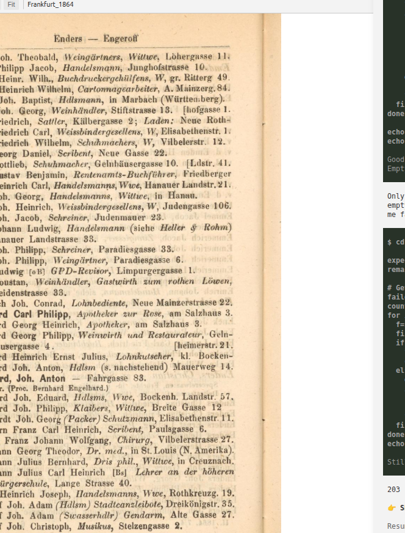

# Provenance & bounding boxes

<p class="lead" markdown="span">A Chronos dataset is verifiable: each record can pin itself to the page and the
region it came from. Three reserved JSON keys carry that link, and the panel turns them into click-to-source
citations. This is how they work.</p>

## The three reserved keys

Include any of these keys in a row object. They are stripped from the table and rendered as citation chips
instead:

| Key | Type | Meaning |
|---|---|---|
| `chronos_page` | integer **or list** | The page the record was read from (file-system index — see below). **Required** for a citation to render. |
| `chronos_bbox` | `[x,y,w,h]` or `{x,y,w,h}` **or list** | *Optional.* The region on that page, normalized 0–1. |
| `chronos_source` | string **or list** | *Optional.* A workspace-relative source path (e.g. `sources/Frankfurt_1864`) when the row comes from a different source than the one in view. |

!!! note
    These keys are a **recommendation**, not a requirement. Rows without them still appear in the table —
    they just have no click-to-source. And the page number is the file-system index (`1` = `page_0001.png`),
    not the printed folio.

## The coordinate system

Bounding boxes use **normalized coordinates in the 0–1 range**, with the origin at the page's **top-left
corner**. The four numbers are:

- `x`, `y` — the top-left corner of the region, as a fraction of page width and height;
- `w`, `h` — the region's width and height, as fractions of the page.

So `[0.0, 0.0, 0.5, 0.5]` is the top-left quarter of the page, and a wide-but-short row of a directory
might be `[0.10, 0.32, 0.80, 0.05]`. Because the values are fractions, they survive re-scanning or
re-scaling — they describe the region on *any* rendering of that page.

<div class="coord-fig">
<svg viewBox="0 0 460 300" role="img" aria-label="Normalized 0 to 1 coordinate system with origin at top-left.">
  <rect x="40" y="20" width="300" height="240" fill="#fbf7ee" stroke="#b9772d" stroke-width="1.5"/>
  <circle cx="40" cy="20" r="4" fill="#b9772d"/>
  <text x="48" y="16" font-family="ui-monospace,monospace" font-size="11" fill="#8a5316">(0, 0) origin · top-left</text>
  <text x="346" y="24" font-family="ui-monospace,monospace" font-size="11" fill="#897b65">x → 1.0</text>
  <text x="6" y="258" font-family="ui-monospace,monospace" font-size="11" fill="#897b65" transform="rotate(-90 14 250)">y → 1.0</text>
  <rect x="100" y="120" width="180" height="46" fill="rgba(185,119,45,0.16)" stroke="#b9772d" stroke-width="2"/>
  <line x1="40" y1="105" x2="100" y2="105" stroke="#897b65" stroke-width="1" stroke-dasharray="3 3"/>
  <text x="52" y="100" font-family="ui-monospace,monospace" font-size="10.5" fill="#5a4e3d">x = 0.20</text>
  <line x1="78" y1="20" x2="78" y2="120" stroke="#897b65" stroke-width="1" stroke-dasharray="3 3"/>
  <text x="82" y="80" font-family="ui-monospace,monospace" font-size="10.5" fill="#5a4e3d">y = 0.42</text>
  <line x1="100" y1="178" x2="280" y2="178" stroke="#b9772d" stroke-width="1"/>
  <text x="150" y="192" font-family="ui-monospace,monospace" font-size="10.5" fill="#8a5316">w = 0.60</text>
  <line x1="292" y1="120" x2="292" y2="166" stroke="#b9772d" stroke-width="1"/>
  <text x="298" y="146" font-family="ui-monospace,monospace" font-size="10.5" fill="#8a5316">h = 0.16</text>
</svg>
</div>

## Try it

Drag the bronze box over this real scan. The readout shows the exact `chronos_bbox` you'd write to pin a
record to that region.

<div class="bbox-demo" data-x="0.08" data-y="0.30" data-w="0.84" data-h="0.06">
  <div class="bbox-stage">
    <div class="bbox-canvas">
      
      <div class="bbox-rect"><span class="bbox-handle"></span></div>
    </div>
  </div>
  <div class="bbox-readout">
    <div class="ro-title">chronos_bbox</div>
    <div class="ro-row"><span class="k">x</span><span class="v">0.080</span></div>
    <div class="ro-row"><span class="k">y</span><span class="v">0.300</span></div>
    <div class="ro-row"><span class="k">w</span><span class="v">0.840</span></div>
    <div class="ro-row"><span class="k">h</span><span class="v">0.060</span></div>
    <div class="bbox-json"></div>
    <div class="bbox-hint">Drag the box to move it; drag the corner to resize. Coordinates are normalized 0–1, relative to the page.</div>
  </div>
</div>

## Two accepted shapes

A box may be written as an **object** `{ "x": 0.1, "y": 0.32, "w": 0.8, "h": 0.05 }` or as a four-element
**array** `[0.1, 0.32, 0.8, 0.05]` (same `x,y,w,h` order). Both are accepted in the JSON you write to
`data/`.

!!! note "One subtlety"
    In output files, both shapes work and the official examples use the array form. But when the model calls
    a *live* tool (`show_page`, `task`, `view_region`), those tools accept the object form only. In practice
    you author the array form into JSON and let the tools use the object form — Chronos handles each
    correctly.

## Citing more than one location

One record can cite several places — a value split across two pages, a figure assembled from regions, a fact
corroborated by a marginal note. Pass the keys as **parallel lists**; the table renders one chip per
reference, each linking to its own page and region. The lists align by index:

```json title="parallel references"
[
  {
    "name": "Anna Weber",
    "chronos_page": [43, 44],
    "chronos_bbox": [[0.10, 0.90, 0.80, 0.06], [0.10, 0.04, 0.80, 0.06]]
  },
  {
    "name": "Karl Vogt",
    "chronos_page": 42,
    "chronos_bbox": [[0.10, 0.32, 0.80, 0.05], [0.55, 0.32, 0.40, 0.05]]
  }
]
```

The rules that make this ergonomic:

- a bare **scalar** is treated as a single-element list (so existing single-citation outputs are unchanged);
- a **length-1 list broadcasts** across the others — one `chronos_source` shared over several pages, or (as with Karl Vogt above) two boxes on one page;
- a reference whose `chronos_page` is missing or non-numeric is **skipped for that index only**, without shifting the others.

A single four-number array like `[0.1, 0.2, 0.3, 0.4]` is read as one box, not four — to give each page its
own box, use a list *of* boxes as shown above.

## How a citation renders

In the **Data tab**, a chip opens the docked region preview — the box outlined in bronze, the margin dimmed
— see [the Data tab](data-viewer.md#click-to-source-the-region-preview). In the **chat**, the same
coordinates appear in a `[view p.N#sel=x,y,w,h]` citation that crops the Page viewer to the region. Under
the hood, cropping multiplies the normalized values by the image's pixel dimensions and clamps to the page
bounds, so a box is never larger than the page.

## Getting good provenance

Provenance is authored by the model, so ask for it explicitly. Effective extraction prompts tell Chronos
to: include `chronos_page` on every row; add a `chronos_bbox` around each record's line or cell; and use the
file-system page index. Saving that instruction as a [skill](skills-memory.md) makes every future volume
consistent.
