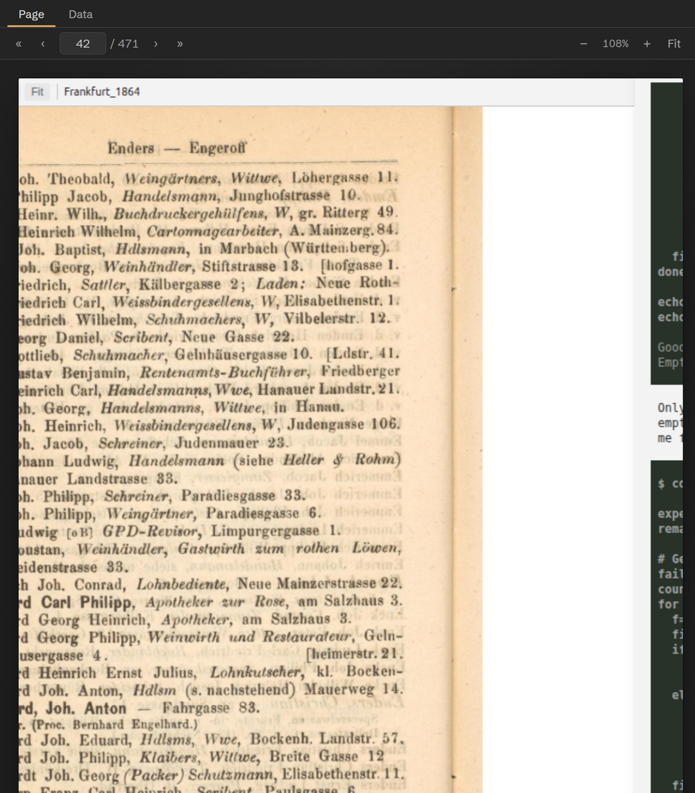

# Sources & the page viewer

A <em>source</em> is one document — a directory volume, a register, a ledger.
This is how sources and their pages are organised, and how the viewer shows, zooms, and crops them.

## What a source is

Each source is a folder under `sources/` with a `png/` subfolder of page images named `page_NNNN.png`
(four-digit, zero-padded — `page_0001.png`). A folder counts as a source only once that `png/` subfolder
exists. JPEG pages (`.jpg`/`.jpeg`) are first-class too; the agent resolves whichever extension is present.

!!! info "Page numbers are file indices"
    Throughout Chronos — `show_page`, the p.&nbsp;N citations, and the
    `chronos_page` key — a page number means the **file-system index** (`1` = `page_0001.png`), *not* the
    printed page number on the scan. A volume whose first scan is the cover starts at page&nbsp;1 regardless
    of what the printed folios say.

## Selecting and switching sources

Three ways to choose what you're working on, all equivalent:

- the **Source** dropdown in the panel header;
- `/select-source` in the chat — with no argument it pops a picker listing each source and its page count; with a name it selects directly;
- the agent's own `change_source` tool, which it uses when a task spans documents.

All three update one shared, in-memory *source context*, so every source-bound tool (`list_pages`,
`show_page`, `show_text`, `task`) redirects to the new source at once — no restart. The choice is
remembered per session and restored when you resume.

## Knowing the extent: list_pages

Before sampling, Chronos calls `list_pages` to learn how big the document is. It reports the first and last
page ids and the total count, and updates the viewer's page-range indicator. It's the recommended first
step on any new source.

## The page viewer

<figure markdown="span">
  
  <figcaption>The page viewer — navigation and zoom over a scanned page on the lit stage. <b>Chronos UI rendered with sample data.</b></figcaption>
</figure>

The viewer renders one page on a "lit stage" (a subtly textured dark backdrop, so the page reads like a
physical sheet). Controls:

| Action | Control |
|---|---|
| Next / previous page | ‹ › or <kbd>←</kbd> / <kbd>→</kbd> |
| Jump ±10 pages | « » or <kbd>Shift</kbd>+<kbd>←</kbd> / <kbd>→</kbd> |
| Go to a page | Type the number in the page box and press <kbd>Enter</kbd> |
| Zoom (25–400%) | − / + step 25%; <kbd>Ctrl</kbd>+scroll steps 10% |
| Fit to width | **Fit** |
| Pan | Scroll — a zoomed page overflows and scrolls in place |

### Showing a region

When the agent (or a citation) targets a *region* of a page, the viewer doesn't draw a box over the whole
page — it **crops to that region and zooms in** at full resolution, so you see the cited detail directly. A
**Full page** button appears to restore the whole scan. (The Data tab's inline preview does the opposite —
it keeps the page and dims around the region; see [the Data tab](data-viewer.md#click-to-source-the-region-preview).)

## Showing text files

Chronos can also display a text file — a schema, a prior output, notes — in the same viewer with
`show_text`. If it passes a passage to highlight, the viewer marks every occurrence in bronze and scrolls
the first one into view.

## Citations drive the viewer

Any time Chronos writes `[view p.N]` in its reply it becomes a clickable p.&nbsp;N
chip; with a region it's `[view p.N#sel=x,y,w,h]` and renders with a ◳ marker
(p.&nbsp;N). Clicking opens that page — and crops to that region — bringing
the Page tab to the front. A citation can even point at a different source with `[view p.N@sourcePath]`,
switching the viewer to that document. The coordinate format behind the `#sel=` fragment is the same one
explained in [Provenance &amp; bounding boxes](provenance.md).
